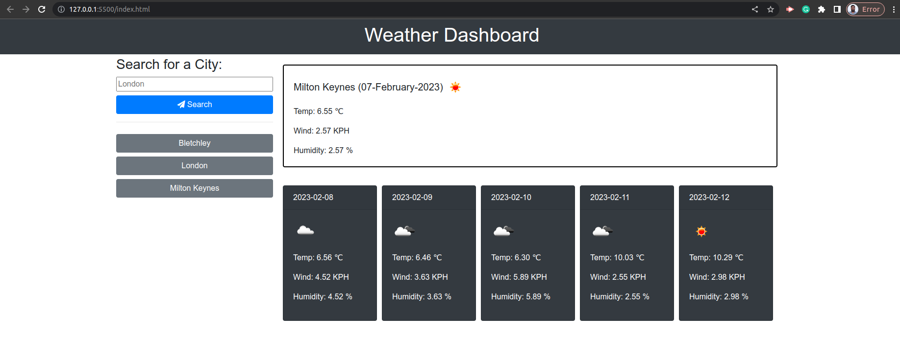
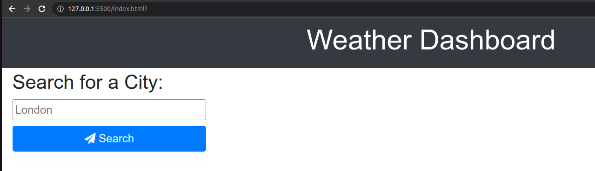
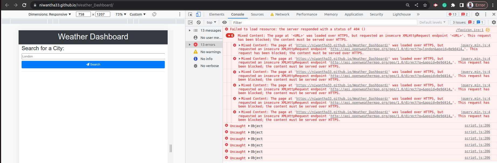

# Weather_Dashboard

link - [https://niwantha33.github.io/Weather_Dashboard](https://niwantha33.github.io/Weather_Dashboard/)





The Weather Dashboard code is created using HTML, CSS and JQuery to retrieve and displays weather data for a particular city. The code uses the jQuery library and Bootstrap classes to create dynamic weather cards. The data for each city is stored in local storage so that the user can access it again in the future. 
Further, it will display today's weather data, and display a 5-day weather forecast. 

## Algorithm for selection of particular forecast hour 

```JavaScript
 weatherList.forEach(element => {

            let filterForecastHour = -1

            let currentHour = Number(luxon.DateTime.now().toFormat('HH'))
            
            let selectForecastHour = Number(((element.dt_txt).split(' '))[1].split(":")[0])
            // openweather API provides data with 3 hours gap, in order to select most suitable 
            // hour to display in each card. 
            // example: if I entered a city, all the forecast will show according to the current time etc..
            switch (selectForecastHour) {

                case 0:
                    if (currentHour >= 0 && currentHour < 3) {
                        filterForecastHour = 0
                    }
                    break;
                case 3:
                    if (currentHour >= 3 && currentHour < 6) {
                        filterForecastHour = 3
                    }
                    break;
                case 6:
                    if (currentHour >= 6 && currentHour < 9) {
                        filterForecastHour = 6
                    }
                    break;
                case 9:
                    if (currentHour >= 9 && currentHour < 12) {
                        filterForecastHour = 9
                    }
                    break;
                case 12:
                    if (currentHour >= 12 && currentHour < 15) {
                        filterForecastHour = 12
                    }
                    break;
                case 15:
                    if (currentHour >= 15 && currentHour < 18) {
                        filterForecastHour = 15
                    }
                    break;
                case 18:
                    if (currentHour >= 18 && currentHour < 21) {
                        filterForecastHour = 18
                    }
                    break;
                case 21:
                    if (currentHour >= 21 && currentHour < 0) {
                        filterForecastHour = 21
                    }
                    break;
                default:
                    filterForecastHour = 0
                    break;

            }

            if (selectForecastHour === filterForecastHour) {
                obj = {
                    icon: element.weather[0].icon, // weather icon 
                    //0K − 273.15  kelvin to Cent & fixed to 2 decimals 
                    temp: ((Number(element.main.temp) - 273.15)).toFixed(2),
                    humidity: element.main.humidity,
                    wind: element.wind.speed,
                    date: ((element.dt_txt).split(' '))[0]
                }
                
                forecastWeatherDataToCards(obj, forecastElement)

            }


```
## Fixed HTTP and HTTPS Bug 

This error occurred due to an insecure HTTP connection, fixed using HTTPS. 


## credits

[Bootstrap - Buttons](https://getbootstrap.com/docs/4.0/components/buttons/)

[Bootstrap - Cards](https://getbootstrap.com/docs/4.0/components/card/)

[Icons](https://fontawesome.com/icons/cloud?s=regular&f=classic)

[$(this)](https://stackoverflow.com/questions/12481439/jquery-this-keyword)

[geocoding](https://openweathermap.org/api/geocoding-api)

[Fahrenheit to Celsius](https://www.metric-conversions.org/temperature/fahrenheit-to-celsius.htm)